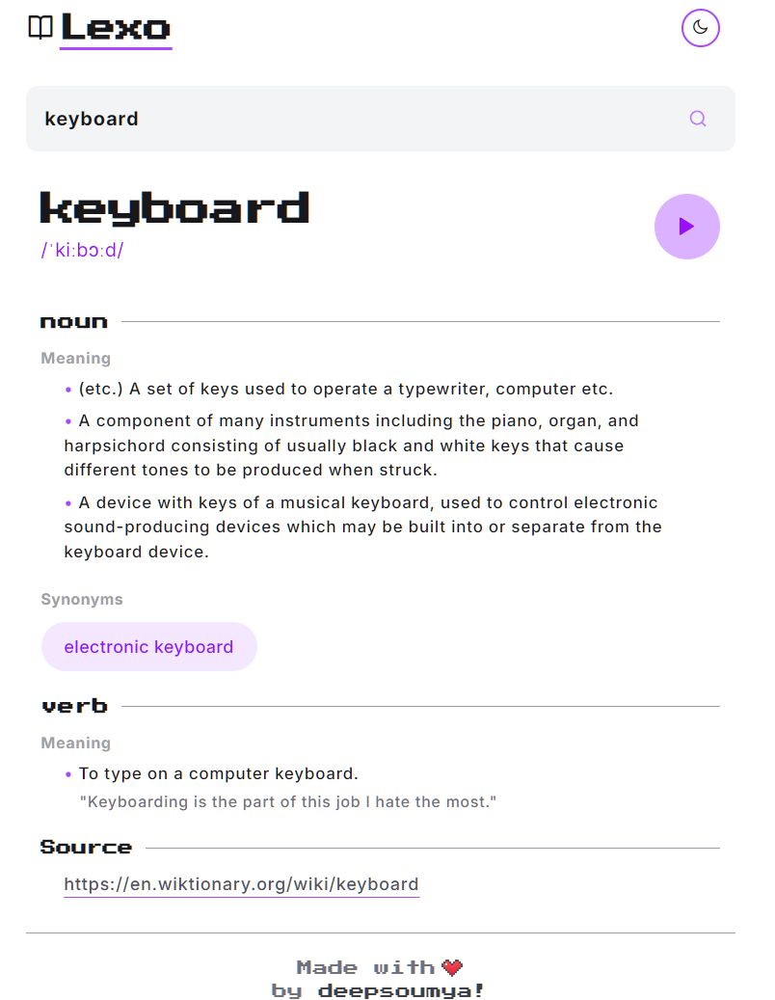
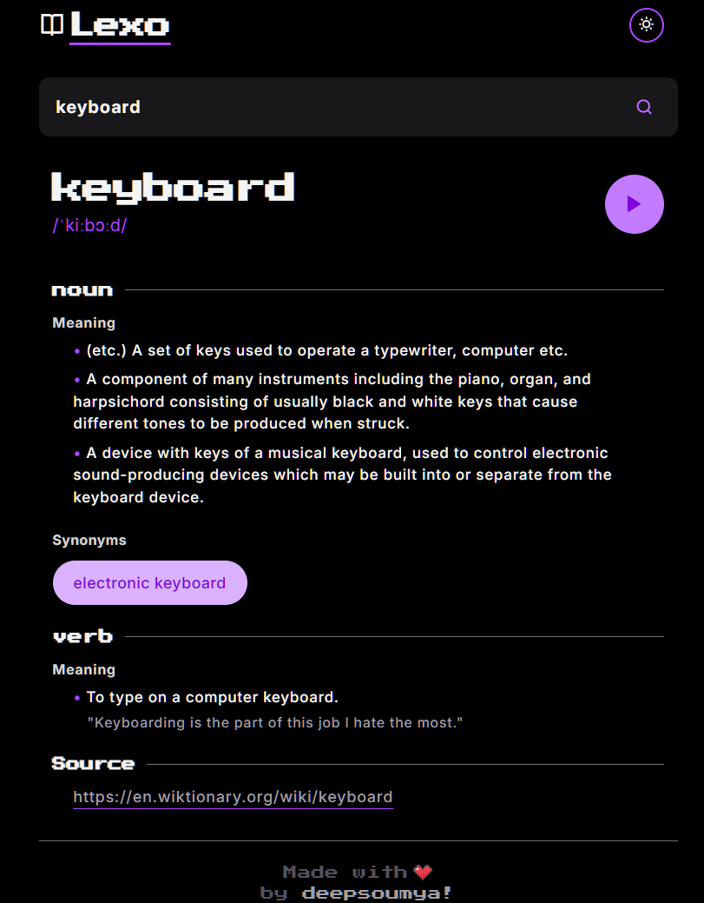

# 📚 Lexo – Minimal Dictionary App

Lexo is a simple and elegant dictionary web app built using ```React``` and styled with ```Tailwind CSS```. It allows users to search for English words and get detailed meanings, examples, and synonyms.

---
## 🖼️ Preview - Light + Dark Mode




---

## 🚀 Features

- 🔍 Search for English words.
- 📖 View definitions, examples, synonyms and part of speech.
- 🧠 Synonyms displayed cleanly below each section.
- ❤️ Clean, mobile-friendly UI.
- ⚡ Caches word data in ```localStorage``` to avoid repeated fetches.

---

## 📁 Folder Structure

```
src/
├── public/           # Favicon + Preview images
├── assets/           # Heart icon
├── components/       # Reusable UI components
│   ├── FooterCard.jsx # Footer
│   ├── Header.jsx     # Header
│   ├── SearchBar.jsx  # Search Area
│   └── WordCard.jsx   # Main Word Card
├── App.jsx           # Main app component
├── index.css         # Global styles
└── main.jsx          # React entry point
```

---

## 🛠️ Tech Stack

- **React**
- **Tailwind CSS**
- **Vite**
- **JavaScript (ES6+)**

---

## 📦 Installation

```bash
git clone https://github.com/deepsoumya617/lexo.git
cd lexo
npm install
npm run dev
```

Then open ```localhost:port``` to view it in the browser.

---

## 💡 TODO

- [✅] Add dark mode toggle
- [❌] Add antonyms section

---

## 🙌 Acknowledgements

- Dictionary API: [Free Dictionary API](https://dictionaryapi.dev/)
- Icons: [Icons8](https://icons8.com/)

---

## 🧑‍💻 Author

Made with ❤️ by [**Soumyadeep Ghosh**](https://github.com/deepsoumya617)
